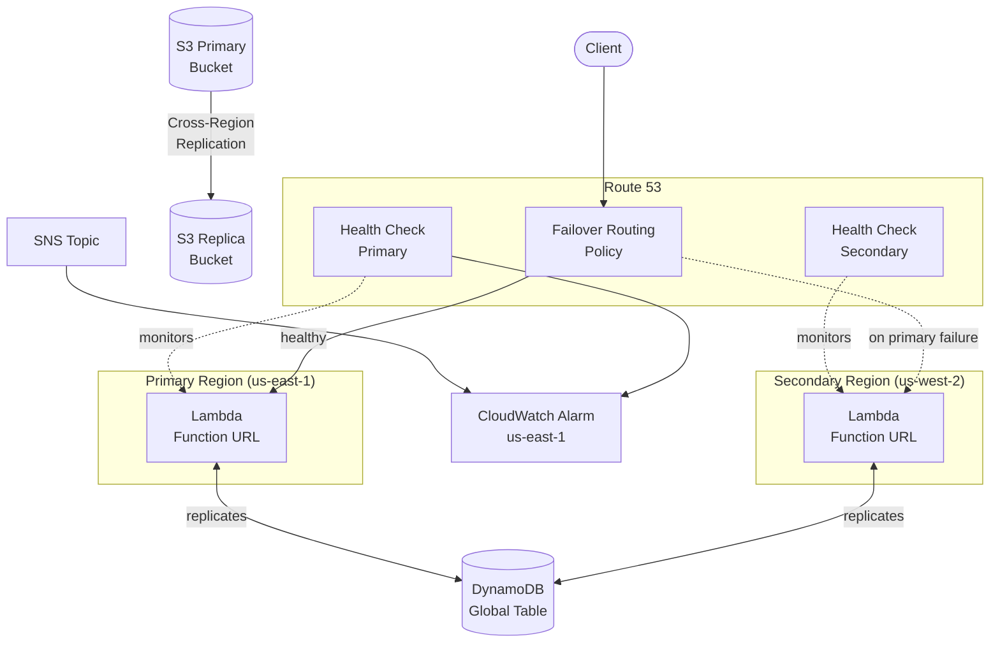

<<<<<<< HEAD
# serverless-dr-reference-architecture
A `terraform apply`-ready module deploying a multi-region, serverless disaster-recovery pattern on AWS: **Lambda + DynamoDB Global Tables + S3 Cross-Region Replication**, with **Route 53 health-check failover** doing the actual traffic cutover — no manual DNS changes, no runbook step where a human flips a switch.
=======
# Serverless DR Reference Architecture

A `terraform apply`-ready module deploying a multi-region, serverless
disaster-recovery pattern on AWS: **Lambda + DynamoDB Global Tables + S3
Cross-Region Replication**, with **Route 53 health-check failover** doing
the actual traffic cutover — no manual DNS changes, no runbook step where a
human flips a switch.

Built as a hands-on complement to the AWS Solutions Architect Associate
material: SAA teaches you *what* DynamoDB Global Tables, S3 CRR, and Route 53
failover routing are; this repo is what it looks like to actually wire the
three together into something that fails over on its own and to *measure*,
rather than assume, how well it does so.

## Architecture



**Why this counts as multi-AZ *and* multi-region:** Lambda, DynamoDB, and S3
are already replicated across Availability Zones within a region by AWS —
that's not something you configure. The part actually worth building (and
testing) is the **region-to-region** failover: DynamoDB Global Tables for
data, S3 CRR for objects, and Route 53 health-check failover for traffic.
That's what this module deploys.

## What's in each layer

| Layer | Mechanism | Module |
|---|---|---|
| Compute | Identical Lambda + Function URL deployed to both regions | `modules/lambda-region` (called twice) |
| Data | DynamoDB Global Table — one resource, replica managed natively | `modules/dynamodb-global-table` |
| Object storage | S3 bucket + replica with Cross-Region Replication, optional Replication Time Control (15-min, 99.99% SLA) | `modules/s3-cross-region-replication` |
| Failover | Route 53 health checks on both regions + failover routing policy + CloudWatch alarm + SNS | `modules/route53-failover` |

## Repo layout

```
.
├── main.tf                    # wires the modules together
├── variables.tf                # all inputs, with working defaults
├── providers.tf                # primary / secondary / us-east-1 aliased providers
├── outputs.tf
├── versions.tf
├── modules/
│   ├── dynamodb-global-table/
│   ├── s3-cross-region-replication/
│   ├── lambda-region/          # instantiated once per region
│   └── route53-failover/
├── lambda_src/index.py         # health-check + canary read/write handler
├── environments/example/       # example tfvars
├── scripts/
│   ├── failover-drill.sh       # simulates a primary outage, times DNS-level RTO
│   └── measure-rto-rpo.sh      # writes+polls a canary item, times replication lag
└── docs/dr-runbook.md          # what to actually do during a real failover
```

## Quick start

```bash
git clone <this-repo>
cd serverless-dr-reference-architecture

terraform init
terraform plan
terraform apply
```

Works with **zero required variables** — every input in `variables.tf` has a
default, including a `us-east-1` / `us-west-2` region pair. To customize:

```bash
cp environments/example/terraform.tfvars.example terraform.tfvars
# edit terraform.tfvars
terraform apply -var-file=terraform.tfvars
```

If you don't own a Route 53 hosted zone, leave `hosted_zone_id` and
`dns_record_name` unset — you'll still get both regional Lambda Function
URLs, both health checks, and the CloudWatch alarm, you just won't get the
DNS-level failover record. Set both to get the full failover CNAME.

### Tear down

```bash
terraform destroy
```

## Measured results

RTO and RPO are workload-, region-pair-, and traffic-pattern-dependent —
they're not a property of the Terraform code alone, so this section ships
empty by design rather than with invented numbers. Run the two scripts below
against your own deployment and fill in your own row.

```bash
# RTO: simulate a primary outage, time how long failover takes
./scripts/failover-drill.sh <primary-function-name> <secondary-function-url-or-failover-dns> <primary-region>

# RPO: write a canary item to the primary, time replication into the secondary
./scripts/measure-rto-rpo.sh <primary-function-url> <secondary-function-url>
```

| Date | Region pair | Samples | Observed RTO | Observed RPO (DynamoDB) | Notes |
|---|---|---|---|---|---|
| _fill in after your first drill_ | | | | | |

For context while you wait on your own numbers, the components' published
behavior:

- **DynamoDB Global Tables**: AWS advertises typical cross-region
  propagation as sub-second under normal load; there's no formal SLA on the
  number, which is exactly why the measurement script exists.
- **S3 Cross-Region Replication**: "best effort" (commonly minutes) without
  Replication Time Control; with RTC enabled (default `true` in this module)
  AWS commits to 99.99% of objects replicating within 15 minutes, backed by
  the `S3.replicationLatency` metric.
- **Route 53 failover**: bounded by `(failure_threshold × request_interval)
  + DNS TTL`. With this module's defaults (3 × 10s + 30s TTL) that's a ~60s
  theoretical ceiling before a fresh DNS lookup gets the new answer — actual
  client-observed time also depends on resolver caching, which
  `failover-drill.sh` captures empirically rather than assumes.

## Security notes

- Lambda Function URLs are deployed with `authorization_type = "NONE"` to
  keep the reference architecture runnable with zero extra setup (SigV4 or
  an authorizer needs a client to sign requests). **Add authentication
  before using this for anything beyond a health-check endpoint.**
- S3 buckets block all public access and use SSE-S3 encryption by default.
  DynamoDB uses server-side encryption and point-in-time recovery on both
  regions.
- IAM roles are scoped to the specific table/bucket ARNs they need, not
  wildcarded.

## Cost notes

Two regions means two of everything. At rest/idle this is inexpensive
(DynamoDB on-demand billing, S3 storage for a near-empty bucket, Lambda's
free tier), but be aware of: Route 53 health checks (~$0.50–$1/mo each),
S3 Replication Time Control (per-GB surcharge on top of standard CRR
transfer), and DynamoDB Global Tables' replicated write cost (each write
counts as a billed write in every region it replicates to).

## License

MIT — see `LICENSE`.
>>>>>>> 29024bd (Initial commit)
